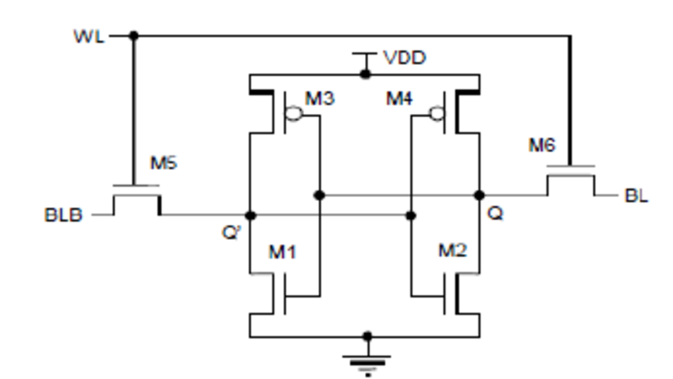

# 6T-SRAM-Operations
Design and simulation of a CMOS-based 6T SRAM cell focusing on Read, Write, and Hold operations along with peripheral circuits using LTSpice.

# 📌Overview
Static Random Access Memory (SRAM) is a high-speed, volatile memory technology used in digital systems to store frequently accessed data and instructions close to the processor. Unlike Dynamic Random Access Memory (DRAM), which stores data as charge on capacitors and requires periodic refresh cycles, SRAM stores information using a bistable latch formed by cross-coupled CMOS inverters. This latch-based structure allows SRAM to retain its stored value as long as power is applied, without the need for refresh operations, resulting in significantly lower access latency and simpler control logic.  
 
SRAM is widely preferred in performance-critical applications such as CPU cache memory, register files, and embedded systems due to its fast read and write capability, strong noise immunity, and stable data retention. Although SRAM occupies more silicon area and is more expensive per bit compared to DRAM, its superior speed and reliability make it the memory of choice where system performance and real-time operation are more important than storage density and cost.  

# 6T SRAM Cell Structure
The conventional 6-transistor (6T) SRAM cell consists of six MOSFETs arranged to form a stable and high-speed memory storage element. It is based on a bistable latch configuration created using two cross-coupled CMOS inverters, which allows the cell to store one bit of data as long as power is supplied.  

**Transistor Composition** 
The six transistors are divided into three functional groups:  
### 1. Storage Inverters (M1, M2, M3, M4)
These four transistors form two cross-coupled CMOS inverters:
- **M3 and M4 (PMOS Pull-Up Transistors)**  
  Connected to VDD, they pull the internal storage nodes high when required.
- **M1 and M2 (NMOS Pull-Down Transistors)**  
  Connected to ground, they pull the storage nodes low.
These inverters create two complementary internal nodes:
 - **Q** → Stores the actual data bit  
 - **Q̅ (Q-bar)** → Stores the inverted value  
This feedback structure ensures data retention and stability during the hold state.

### 2. Access Transistors (M5 and M6)
These NMOS transistors connect the internal nodes **Q** and **Q̅** to the bit lines:
- **BL (Bit Line)**  
- **BLB (Bit Line Bar / Complement)**  
- Controlled by the **Word Line (WL)**

### Operation

- **WL = HIGH** → M5 and M6 turn **ON**  
  The cell is connected to the bit lines for read or write operation.
- **WL = LOW** → M5 and M6 turn **OFF**  
  The cell is isolated and remains in hold mode.
